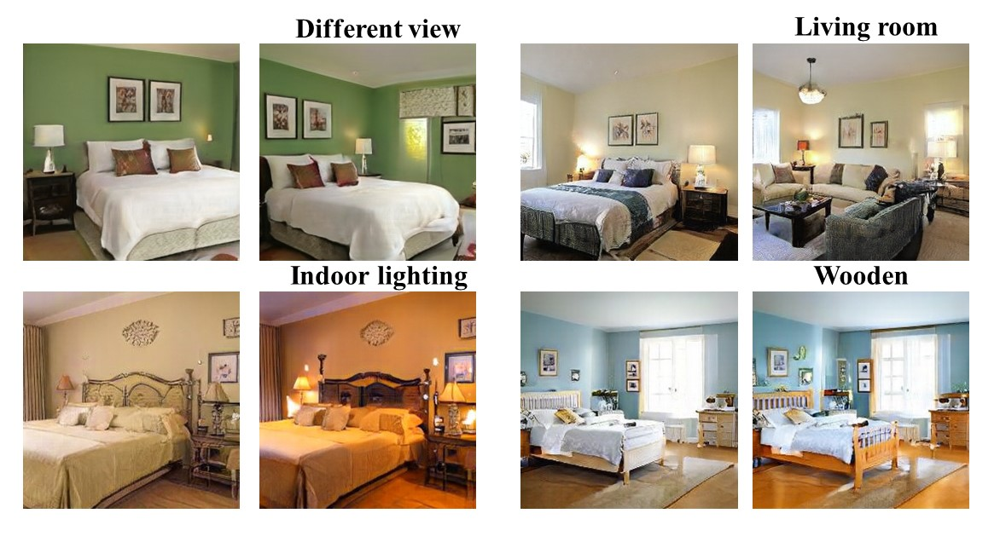

# HiGAN - Semantic Hierarchy Emerges in Deep Generative Representations for Scene Synthesis



**Figure:** *Scene manipulation from different abstract levels: including layout, categorical object, and scene attributes.*

In this repository, we propose an effective framework, termed as HiGAN, to interpret the semantics learned by GANs for scene synthesis. It turns out that GAN models, which employ layer-wise latent codes, spontaneously encode the semantics from different abstract levels in the latent space in a hierarchical manner. Identifying the most relevant variation factors significantly facilitates scene manipulation.

[[Paper](https://arxiv.org/pdf/1911.09267.pdf)]
[[Project Page](https://genforce.github.io/higan/)]

## Usage of Semantic Manipulation

A simple example of mainpulting "indoor lighting" of bedroom:

```bash
python simple_manipulate.py stylegan_bedroom indoor_lighting
```

You will get the manipulation results at `manipulation_results/stylegan_bedroom_indoor_lighting.html` which looks like following. Images can be directly downloaded from the html page.


User can also customize their own manipulation tool with script `manipulate.py`. First, a boundary list is required. See the sample below:

```txt
(indoor_lighting, w): boundaries/stylegan_bedroom/indoor_lighting_boundary.npy
(wood, w): boundaries/stylegan_bedroom/wood_boundary.npy
```

Execute the following command for manipulation:

```bash
LAYERS=6-11
python manipulate.py $MODEL_NAME $BOUNDARY_LIST \
    --num=10 \
    --layerwise_manipulation \
    --manipulate_layers=$LAYERS \
    --generate_html
```

## Pre-trained Models

Pre-trained **GAN models**: [GAN Models](./models/README.md).

Pre-trained **predictors**: [Predictors](./predictors/README.md).

## Train on Your Own Data

### Step-1: Synthesize images and get semantic prediction

```bash
MODEL_NAME=stylegan_bedroom
OUTPUT_DIR=stylegan_bedroom
python synthesize.py $MODEL_NAME \
    --output_dir=$OUTPUT_DIR \
    --num=500000 \
    --generate_prediction \
    --logfile_name=synthesis.log
```

### Step-2: Boundary search for potential candidates (repeat)

```bash
BOUNDARY_NAME=indoor_lighting
python train_boundary.py $OUTPUT_DIR/w.npy $OUTPUT_DIR/attribute.npy \
    --score_name=$BOUNDARY_NAME \
    --output_dir=$OUTPUT_DIR \
    --logfile_name=${BOUNDARY_NAME}_training.log
```

### Step-3: Rescore to identity the most relevant semantics

Use following command to conduct the layer-wise analaysis and identify relevant semantics:

```bash
BOUNDARY_LIST=stylegan_bedroom/boundary_list.txt
python rescore.py $MODEL_NAME $BOUNDARY_LIST \
    --output_dir $OUTPUT_DIR \
    --layerwise_rescoring \
    --logfile_name=rescore.log
```

## Bibtex

```bibtex
@article{yang2019semantic,
  title   = {Semantic hierarchy emerges in deep generative representations for scene synthesis},
  author  = {Yang, Ceyuan and Shen, Yujun and Zhou, Bolei},
  journal = {arXiv preprint arXiv:1911.09267},
  year    = {2019}
}
```
